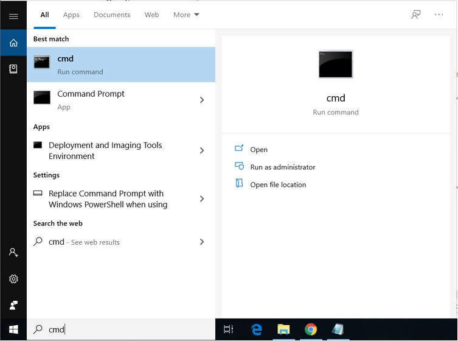
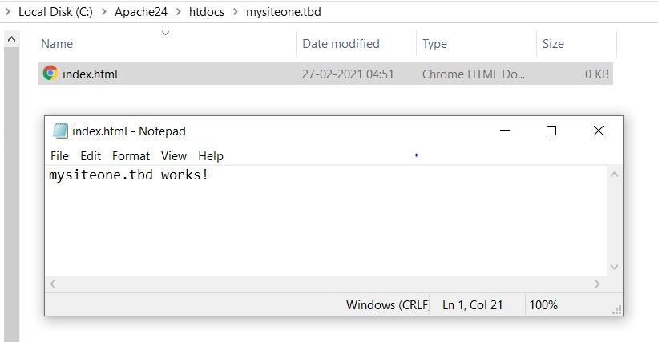
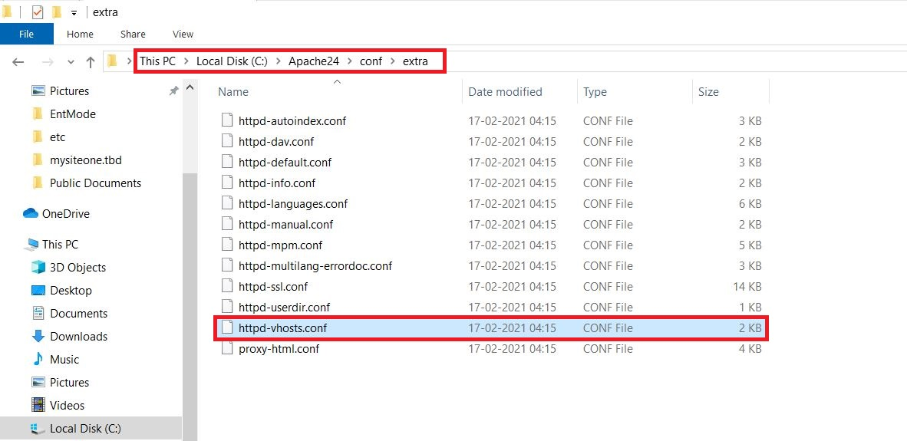
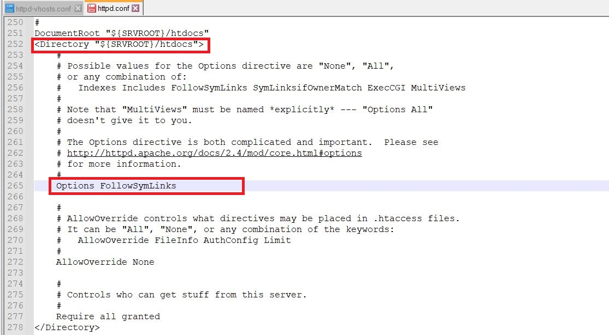

# **Manual Installation - *Apache | PHP | MySQL***<br>
<br>

## **Table of Contents**<br>

[**Part 1. Apache 2.4 Installation & Setup**](#part-1-apache-24-installation-and-setup)
  * [1-1 **Download and Configuration**](#1-1-download-and-configuration)
  * [1-2 **Start Apache Server**](#1-2-start-apache-server)
  * [1-3 **Install Apache as a Windows Service**](#1-3-install-apache-as-a-windows-service)

[**Part 2. Setting up Virtual Hosts**](#part-2-setting-up-virtual-hosts)
  * [2-1 **Update hosts file**](#2-1-update-hosts-file)
  * [2-2 **Add Virtual Hosts**](#2-2-add-virtual-hosts)
  * [2-3 **Modify Apache Configuration Files**](#2-3-modify-apache-configuration-files)

[**Part 3. Directory Browsing**](#part-3-directory-browsing)
  * [3-1 **Test Directory Browsing**](#3-1-test-directory-browsing)
  * [3-2 **Disable Directory Browsing**](#3-2-disable-directory-browsing)

[**Part 4. PHP 8.0 Installation & Setup**](#part-4-php-80-installation-and-setup)
  * [4-1 **PHP Download and Configuration**](#4-1-php-download-and-configuration)
  * [4-2 **Configuration in Apache**](#4-2-configuration-in-apache)

[**Part 5. SSL and Redirect**](#part-5-ssl-and-redirect)
  * [5-1 **Create SSL Certificate**](#5-1-create-ssl-certificate)
  * [5-2 **SSL Configuration in Apache**](#5-2-ssl-configuration-in-apache)
  * [5-3 **Test SSL and Redirect**](#5-3-test-ssl-and-redirect)

[**Part 6. MySQL Installation**](#part-6-mysql-installation)

[**Final Apache Configuration Files**](#final-apache-configuration-files)

<br><br>


# **Part 1. Apache 2.4 Installation and Setup**

    In this section, we will download and setup Apache version 2.4 and verify that the server is running without any problems.

## 1-1 **Download and Configuration**
---

1. Download Apache from [Apache Official Site](https://www.apachelounge.com/download/) .

        Before installing Apache, make sure to install latest Visual C++ Redistributable from the link provided on the website.  
    
    <br><br>

  - Installing Visual C++ Redistributable

    <br><br>
    
2. After downloading and extracting the ZIP, you will find an **Apache24** folder and a **ReadMe** file. The ReadMe file contain instructions of the setup.

    <br>
    
    <br><br>
    
3. According to the **ReadMe** file, we have to move folder **Apache24** to a location which defaults to **C** drive. If the folder is kept in some other location, the same needs to be updated in the configuration file - **Apache24/config/httpd.conf**

    <br><br>
    
## 1-2 **Start Apache Server**
---

1. To start Apache server, we need to run **httpd.exe** file inside **Apache24/bin** folder.

    <br><br>

- Start command prompt as an administrator.

    <br><br>

- Change directory to **C:/Apache24/bin** by typing **&#39;cd C:/Apache24/bin&#39;** in the command prompt **.**

- Type **httpd.exe** and press enter to start the Apache server. Click **Allow Access** if there is a windows security alert.

    <br><br>

- If there is no error in the terminal, the server is started.

    <br><br>

2. To verify if the server is running properly, open localhost in the browser and it should open the below page.

    <br><br>

3. The html page loaded in the browser is stored under **C:/Apache24/htdocs** folder which is the default document root directory.

    <br><br>

## 1-3 **Install Apache as a Windows Service**
---

1. stop the server (if already running) by pressing **Ctrl+C** in the command prompt.
2. Change directory to **C:/Apache24/bin,** if not already there.
3. Type &#39; **httpd.exe -k install&#39;** and press enter.

    <br><br>

4. Open Windows services and start service named as **Apache2.4.**

    >If the service fails to start, run **httpd.exe** from command prompt as earlier to see the errors causing it to fail.

    <br>
    <br>

    <br><br>

5. Open localhost in the browser to verify.

    <br><br>

# **Part 2. Setting up Virtual Hosts**

    In this section, we will setup two virtual sites as given below.

1. mysiteone.tbd

    >This site will be created inside apache&#39;s default document root directory - **C:/Apache24/htdocs**. The site will be accessible via port 80.

2. mysitetwo.tbd

    >This site will be created outside apache&#39;s default document root directory. The site will be accessible via port 8088.

<br>

## 2-1 **Update hosts file**
---

    To update hosts file, we need to edit it using notepad running with administrator privileges.

1. Type **notepad** in the search bar and click **run as administrator**

    <br><br>

2. Click **open** under **File** menu and browse to directory **C:/Windows/System32/drivers/etc/**

3. Make sure **&#39;All files&#39;** is selected in file type dropdown

    <br><br>

4. Once **hosts** file is loaded, add entries for our two virtual sites to be added and save the file. Here, 127.0.0.1 refers to localhost.

    <br><br>

## 2-2 **Add Virtual Hosts**
---

    To update hosts file, we need to edit it using notepad running with administrator privileges.

1. For the first site, under **C:/Apache24/htdocs** create a folder **mysiteone.tbd.** The folder name can be different from the domain name entry in hosts file.

    <br><br>

2. Under folder **mysiteone.tbd,** create a new text file, rename it as **index.html.** Open the file and add HTML content to it.

    <br><br>

3. For second site, create a folder called **mysitetwo.tbd** somewhere outside of default document root directory (**C:/Apache24/htdocs).**

    >In this document, I have created it under **E:/virtual-sites** directory. As per the previous step, add an **index.html** file under **mysitetwo.tbd** folder.

    <br><br>

## 2-3 **Modify Apache Configuration Files**
---

1. Using an editor, open **httpd-vhosts.conf** file located inside **C:/Apache24/conf/extra** folder.

        This file is used for writing configurations for virtual sites added by the user.

    <br><br>

2. Remove any dummy VirtualHost elements from the file and add the following for our two sites.

    ```xml
    1. Listen 8088
    ```
    ```xml
    2. <VirtualHost mysiteone.tbd:80>;
          DocumentRoot '${SRVROOT}/htdocs/mysiteone.tbd';
          ServerName mysiteone.tbd
      </VirtualHost>;
    ```
    ```xml
    3. <VirtualHost mysitetwo.tbd:8088>;
          DocumentRoot 'E:/virtual-sites/mysitetwo.tbd'
          ServerName mysitetwo.tbd
          <Directory 'E:/virtual-sites/mysitetwo.tbd'>;
              Require all granted
          </Directory>;
      </VirtualHost>;
    ```

    >**Explanation:**
    >
    >- As one of the sites (mysitetwo.tbd) will run on port 8088, we make Apache listen to that port.
    >- In **VirtualHost** elements, site names must match the domain names in the **hosts** file.
    >- **DocumentRoot** is the location of the site directory inside which **index.html** is present.
    >- For **mysitetwo.tbd**, Directory element is added to grant access permission to that folder because it is outside the default document root directory.

    <br><br>

3. Using an editor, open **httpd.conf** file located inside **C:/Apache24/conf** folder. This file is the main configuration file used by Apache.

    <br><br>

4. In this file, make sure '**Include conf/extra/httpd-vhosts.conf**' is uncommented to include our virtual site configurations.

    <br><br>

5. Restart Apache server from the services. If fails, run **httpd.exe** from command line to check the errors.

    <br><br>

6. Once the server is up and running, open **http://mysiteone.tbd** and **http://mysitetwo.tbd** in the browser. This should display the content of **index.html** file for each site.

    <br>

    <br><br>

# **Part 3. Directory Browsing**

><br>When a site loads in the server, the server looks for a file named **index.html** right inside the project directory.
>
>In both the virtual sites, we have an **index.html** file in project root directories which loads as soon as the site is accessed in the browser.
>
>When server is unable to find this file in the project, it serves directories and files inside the project folder.<br><br>

<br>

## 3-1 **Test Directory Browsing**
---


><br>To open directory browsing, we will rename **index.html** to something else and the browser should load the project files and directories.
>
>We will use **mysiteone.tbd** project for working with directory browsing.<br><br>

1. Rename **index.html** to **\_index.html** in **C:/Apache24/htdocs/mysiteone.tbd** and create some dummy folders and files if needed for testing purposes.

    <br><br>

2. Restart the server and open **http://mysiteone.tbd** in the browser and this should load the project directory.

    <br><br>

## 3-2 **Disable Directory Browsing**
---

    Ideally, when an index page is not found, the user should not be able to see access project resources in the browser. Hence, it is recommended to disable directory browsing in servers.

1. Open **C:/Apache24/conf/httpd.conf** file and remove **Indexes** from **Options** directive.

    <br>

    >You can find this inside **<Directory '${SRVROOT}/htdocs'>** element. After changes, it should look like the picture below.

    <br><br>

2. Restart the server and open **http://mysiteone.tbd** in the browser. Now the browser will not display project files and returns a **Forbidden** message.

    <br><br>

# **Part 4. PHP 8.0 Installation and Setup**
    In this section, we install and setup PHP version 8.

## 4-1 **PHP Download and Configuration**
---

1. Open [PHP download page](https://windows.php.net/download#php-8.0).

    >On the page, you would find that for Apache, we have to download the **Thread Safe (TS)** version of PHP.

    >Download VS16 Thread Safe ZIP file.
    
    <br><br>

2. Extract the ZIP inside **C:/PHP** folder

    <br>

    <br><br>

3. Go to **C:/PHP** and rename the php configuration file **php.ini-development** to **php.ini**

    <br>

    <br><br>

## 4-2 **Configuration in Apache**
---

1. Open Apache configuration file **C:/Apache24/conf/httpd.conf** and add the following to it.
    ```php
    # PHP8 module

    LoadModule php\_module 'c:/php/php8apache2\_4.dll'
    AddType application/x-httpd-php .php
    PHPIniDir 'C:/php'
    ```
    <br><br>

2. In **C:/Apache24/htdocs/mysiteone.tbd** , create a php file **phpconfig.php** and add following to it.

    ```php
    <?php
      phpinfo();
    ?>;
    ```

    <br><br>

3. Restart the server and open **https://mysiteone.tbd/phpconfig.php** in the browser. This should load a php information page.

    <br><br>

# **Part 5. SSL and Redirect**

>In this section, we will create a self-signed SSL certificate for site **mysiteone.tbd** using **openssl.**
>
>After the SSL certificate is created and configured, the site will be accessible via port 443.
>
>We will also enable redirection so that the site accessed via port 80 will be redirected to port 443.

<br>

## 5-1 **Create SSL Certificate**
---

1. Open location **C:/Apache24/bin/** and double-click (run) **openssl.exe** file. This will open a shell terminal.

2. Write the following (single) command and press enter:

    ```
    req -x509 -nodes -days 365 -newkey rsa:2048 -keyout mysiteone.key -out mysiteone.crt
    ```

    >You will be prompted to enter organizational and other information which is optional.
    >
    >This command will create a self-signed certificate valid for 365 days.

    <br><br>

3. After the command is finished running, two files will be created in the current (bin) folder – **mysiteone.crt** and **mysiteone.key**

    <br><br>

4. I moved these files to a new folder called **ssl\_mysiteone** under **C:/Apache24/conf** directory just to keep the files organized.

    <br><br>

## 5-2 **SSL Configuration in Apache**
---

1. Open file **C:/Apache24/conf/extra/httpd-vhosts.conf** and add lines highlighted in below picture.

    **Listen to port 443:**  

        Listen 443

    **Create a new virtual host for port 443:**

    ```xml
    <VirtualHost mysiteone.tbd:443>
        DocumentRoot '${SRVROOT}/htdocs/mysiteone.tbd'
        ServerName mysiteone.tbd
        SSLEngine on

        SSLCertificateFile '${SRVROOT}/conf/ssl\_mysiteone/mysiteone.crt'
        SSLCertificateKeyFile '${SRVROOT}/conf/ssl\_mysiteone/mysiteone.key'
    </VirtualHost>
    ```

    **Redirect port 80 site to https:** 

    ```xml
    Redirect permanent / https://mysiteone.tbd
    ```

    <br><br>

2. Open file **C:/Apache24/conf/httpd.conf** and enable ssl module by uncommenting it.

    <br><br>

## 5-3 **Test SSL and Redirect**
---

1. Open **https://mysiteone.tbd** in browser (notice **https**). You may get a private connection warning, just click **Advanced** and then click **proceed to https://mysiteone.tbd**(unsafe).

    <br><br>

2. This will load our site on port 443 using our self-signed SSL certificate.

    <br><br>

3. Try opening **http://mysiteone.tbd** (notice http) and this should redirect to **https** page.

<br><br>

# **Part 6. MySQL Installation**

1.	Follow below steps to download MySQL from the [official site](https://dev.mysql.com/downloads/mysql/).

    <br>
    <br>
    <br><br>
 
2.	Run the downloaded msi file.
3.	In Setup Type, I will be selecting **Server only** because management tools are not required for this server setup. You may choose to install other tools by selecting **Custom**.
 
    <br>
    <br><br>

4.	Select configuration as given in below pictures.
 
    <br>
    <br><br>

5.	Set a password for **root user**. You may add a new user if necessary.
 
    <br><br>

6.	Check the options as below to configure MySQL as a windows service. Notice the default name for service will be **MySQL80**.
 
    <br><br>

7.	On the next window, click **Execute** and then **Finish** after configuration is completed.
 
    <br><br>

8.	Click **Next** on **Product Configuration** window and finally click **Finish** when installation is complete.
 
    <br>
    <br><br>

9.	Verify MySQL installation by checking if **MySQL80** service is running.

    <br><br>


# **Final Apache Configuration Files**

1.	Download [httpd.conf](config_files/httpd.conf)

        Replace this file with C:\Apache24\conf\httpd.conf

2.	Download [httpd-vhosts.conf](config_files/httpd-vhosts.conf)

        Replace this file with C:\Apache24\conf\extra\httpd-vhosts.conf


